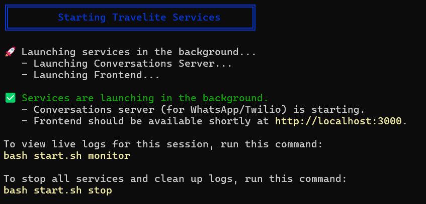
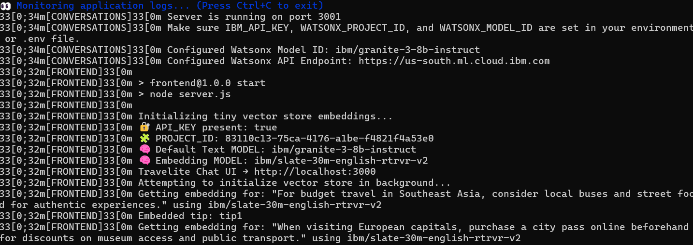
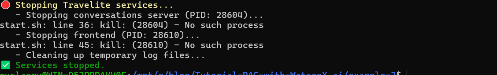

# Watsonx.ai –  Travel assistant chatbot - Simple RAG Demo

Hello everyone, this is a simple demo to explain how it works RAG in a simple application webapp.

## Overview
 Travel assistant chatbot that leverages Retrieval-Augmented Generation (RAG) and IBM watsonx.ai to provide personalized travel recommendations and chat experiences. It features a web frontend and a WhatsApp/Twilio integration for conversational access.

---

## Folder Structure
- `frontend/` – Web chat interface (Node.js/Express, EJS, CSS)
- `conversations/` – WhatsApp/Twilio bot server (Node.js/Express)
- `test_sdk/` – Python scripts for testing IBM watsonx.ai API

---

## Quick Start

### 1. Clone the repository
```bash
git clone https://github.com/ruslanmv/Watsonx-Travel-Assistant-Chatbot
cd Watsonx-Travel-Assistant-Chatbot
```

### 2. Set up environment variables
Create a `.env` file in both `frontend/` and `conversations/` with your IBM watsonx.ai credentials and Twilio keys (see code comments for required variables).

---

## Running the Web Frontend
1. Install dependencies:
   ```bash
   cd frontend
   npm install
   ```
2. Start the server:
   ```bash
   npm start
   ```
3. Visit `http://localhost:3000` in your browser.

---

## Running the WhatsApp/Twilio Bot
1. Install dependencies:
   ```bash
   cd conversations
   npm install
   npm install -g ngrok
   ```
2. Start the server:
   ```bash
   node index.js
   ```
3. Start ngrok to expose your local server:
   ```bash
   ngrok http 3000
   ```
4. Set your Twilio WhatsApp webhook to the ngrok URL + `/incoming` (see `conversations/instructions.md`).

---

## Testing IBM watsonx.ai API (Python)
1. Install Python dependencies:
   ```bash
   pip install -r requirements.txt
   ```
2. Edit `.env` in `test_sdk/` with your API credentials.
3. Run the test script:
   ```bash
   python test_sdk/request.py
   ```

## Automatic script

```bash
bash start.sh
```



```bash
bash start.sh  monitor
```


---

```bash
bash start.sh  stop
```

